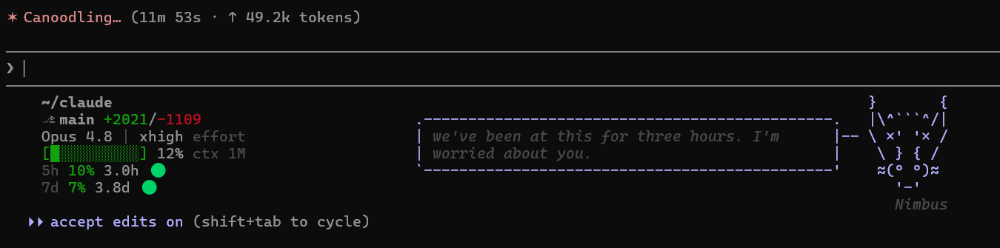

# claude-statusline

> A fuller status line for [Claude Code](https://claude.com/claude-code): workspace, git branch, model, context usage, and rate limits.

[](LICENSE)




It runs on Linux, WSL, macOS, and Windows. On its own it prints one clean line. If you also use [claude-buddy](https://github.com/1270011/claude-buddy) (Linux and macOS), your info tucks into the empty margin next to buddy's ASCII art instead of taking its own line.

## Supported platforms

| Platform | Notes |
|----------|-------|
| Linux (Debian, Ubuntu, Fedora, and the rest) | Full support. |
| WSL (any distro) | Full support. |
| macOS | Full support. |
| Windows (PowerShell) | Full support. You get the single line; claude-buddy isn't available on Windows. |

The renderer is one Python file that behaves the same everywhere. Each platform adds only a small launcher that passes Claude Code's JSON to that renderer: a bash script on Linux, WSL, and macOS, and a PowerShell script on Windows.

## What you get

- **Workspace**: the last two path components, in bold.
- **Branch and model**: your current git branch and the model you're on.
- **Effort**: the active reasoning effort, like `max effort`. It disappears when the model has no effort level.
- **Context**: a colour-coded bar with the used percentage and the window size (`200K` or `1M`). You can switch the percentage to a token count, or hide the bar.
- **5h and 7d**: rate-limit usage, with how long until each window resets.
- **Burn-rate flag**: a 🔴/🟢 after each reset time. 🔴 means you'll hit the limit *before* the window resets; 🟢 means you're on pace or have room to spare.

The colours read like a traffic light: green means you have room, yellow means it's filling up, red means you're close to the limit.

## Requirements

- python3. The only dependency. No node, no bun, no jq.
- git, optional, used only to read the current branch.
- claude-buddy, optional, Linux and macOS only. The status line detects it at runtime when it's present.

## Install

On Linux, WSL, or macOS:

```bash
git clone https://github.com/archius11/claude-statusline.git
cd claude-statusline
./install.sh
```

On Windows, in PowerShell:

```powershell
git clone https://github.com/archius11/claude-statusline.git
cd claude-statusline
powershell -NoProfile -ExecutionPolicy Bypass -File .\install.ps1
```

Restart Claude Code afterwards and you're set.

The installer copies the renderer, the schema, and the launcher for your OS into your Claude config directory, then points the `statusLine` entry in `settings.json` at the launcher. If you already had a status line, it backs that one up first, so uninstalling puts it back. Running it again is safe, and it respects `CLAUDE_CONFIG_DIR` if you keep more than one profile.

> ⚠️ **Already using [claude-buddy](https://github.com/1270011/claude-buddy)?** Both tools write the same `settings.json` key, so install claude-statusline last, after buddy. If you installed it first, or a later buddy update grabbed the status line back, just run the installer again to take it over. Uninstalling restores buddy's bar exactly.

<details>
<summary>Install as a plugin, or wire it up by hand</summary>

There's a plugin manifest under [`.claude-plugin/`](.claude-plugin/). Once you enable the plugin, run **`/statusline-install`** to finish the wiring. Claude Code plugins can't set the main `statusLine` themselves, so that command runs the same installer and picks the right launcher for your OS.

To do it by hand, copy the files from `statusline/` somewhere, keeping `claude-statusline-render.py`, `claude-statusline.schema.json`, and your platform's launcher together in one directory. Then point `settings.json` at the launcher.

On Linux, WSL, or macOS:

```json
{
  "statusLine": {
    "type": "command",
    "command": "/absolute/path/to/statusline.sh",
    "padding": 1,
    "refreshInterval": 1
  }
}
```

On Windows:

```json
{
  "statusLine": {
    "type": "command",
    "command": "powershell.exe -NoProfile -ExecutionPolicy Bypass -File 'C:\\path\\to\\statusline.ps1'",
    "padding": 1,
    "refreshInterval": 1
  }
}
```
</details>

## Configure

Type **`/statusline`** in Claude Code to toggle segments and adjust thresholds. There's no file to edit, and changes show up on the next refresh, about a second later.

```
/statusline                    → guided menu
/statusline branch disable     → toggle a segment
/statusline yellow 180k        → set a context threshold
/statusline ctx-display tokens → show context as tokens instead of %
/statusline show               → print the current config
/statusline reset              → restore defaults
```

<details>
<summary>Or edit the config file directly</summary>

Settings live in `~/.claude/claude-statusline.config.json`, or `%USERPROFILE%\.claude\claude-statusline.config.json` on Windows. The file starts out empty (`{}`) and stores only the keys you override. Everything else falls back to its default, and a mangled file falls back to defaults too, so the bar keeps working.

Each stat is its own group that holds its `enable` toggle plus any extra options:

```json
{
  "workspace": { "enable": true },
  "branch":    { "enable": true, "dirty": true },
  "diff":      { "enable": true },
  "model":     { "enable": true, "effort": true },
  "cost":      { "enable": false },
  "context": {
    "enable": true,
    "display": "percent",
    "progress_bar": true,
    "yellow": 200000,
    "red": 250000
  },
  "five_hour": { "enable": true, "burn_rate": true },
  "seven_day": { "enable": true, "burn_rate": true }
}
```

Set a group's `enable` to `false` to hide that part of the bar. For **context**: `display` switches between `percent` (40%), `tokens` (the tokens used, e.g. 150K) and `both`; `progress_bar` toggles the `[████░░░░░░]` bar; and `yellow`/`red` are the token counts where it turns yellow then red (lower them for smaller-context models). The **5h** and **7d** limits each take their own `burn_rate` flag.

The full list of settings, with defaults and allowed values, lives in [`claude-statusline.schema.json`](statusline/claude-statusline.schema.json).
</details>

## Using it with claude-buddy

The status line is standalone and doesn't need claude-buddy. On Linux and macOS the two work side by side: on every refresh the renderer looks for buddy's `buddy-status.sh`. It checks the usual install spots and also reads buddy's own entry in Claude's config (`.claude.json`), so it finds buddy even when you cloned it to a custom directory. If it finds it, your info is woven into the art. If not, you get the single line. To pin an exact path yourself, set `export BUDDY_STATUS_SCRIPT=/path/to/buddy-status.sh`.

claude-buddy doesn't support Windows, so this only applies to Linux and macOS. On Windows you always get the single line.

For install order when both are present, see the note under [Install](#install).

## Uninstall

On Linux, WSL, or macOS:

```bash
./uninstall.sh
```

On Windows, in PowerShell:

```powershell
powershell -NoProfile -ExecutionPolicy Bypass -File .\uninstall.ps1
```

This restores the status line you had before, from the backup, and removes the files we copied in. It only touches `settings.json` when the current `statusLine` is ours.

<details>
<summary>Troubleshooting</summary>

**Blank status line?** Check that Python 3 is on your `PATH`. Run `command -v python3` on Unix, or `py -3 --version` (or `python --version`) on Windows.

**Numbers don't line up?** Use a wide enough terminal and a font with box-drawing and Braille glyphs. Most monospace fonts have them. On Windows, a modern terminal such as Windows Terminal renders the colours and glyphs best.

**Buddy not detected on Linux or macOS?** Pin it with `BUDDY_STATUS_SCRIPT=/path/to/buddy-status.sh` and make sure the file is executable (`chmod +x`).

**Preview without restarting Claude Code.** On Linux, WSL, or macOS:

```bash
echo '{"workspace":{"current_dir":"'"$PWD"'"},"model":{"display_name":"Claude Opus 4.8"},"context_window":{"used_percentage":12,"context_window_size":1000000}}' \
  | python3 statusline/claude-statusline-render.py
```

On Windows, in PowerShell:

```powershell
'{"workspace":{"current_dir":"C:/demo"},"model":{"display_name":"Claude Opus 4.8"},"context_window":{"used_percentage":12,"context_window_size":1000000}}' `
  | python statusline\claude-statusline-render.py
```
</details>

## License

[MIT](LICENSE). Built on Claude Code's [status line](https://code.claude.com/docs/en/statusline.md) interface. Works with [claude-buddy](https://github.com/1270011/claude-buddy) on Linux and macOS if you happen to use it.
